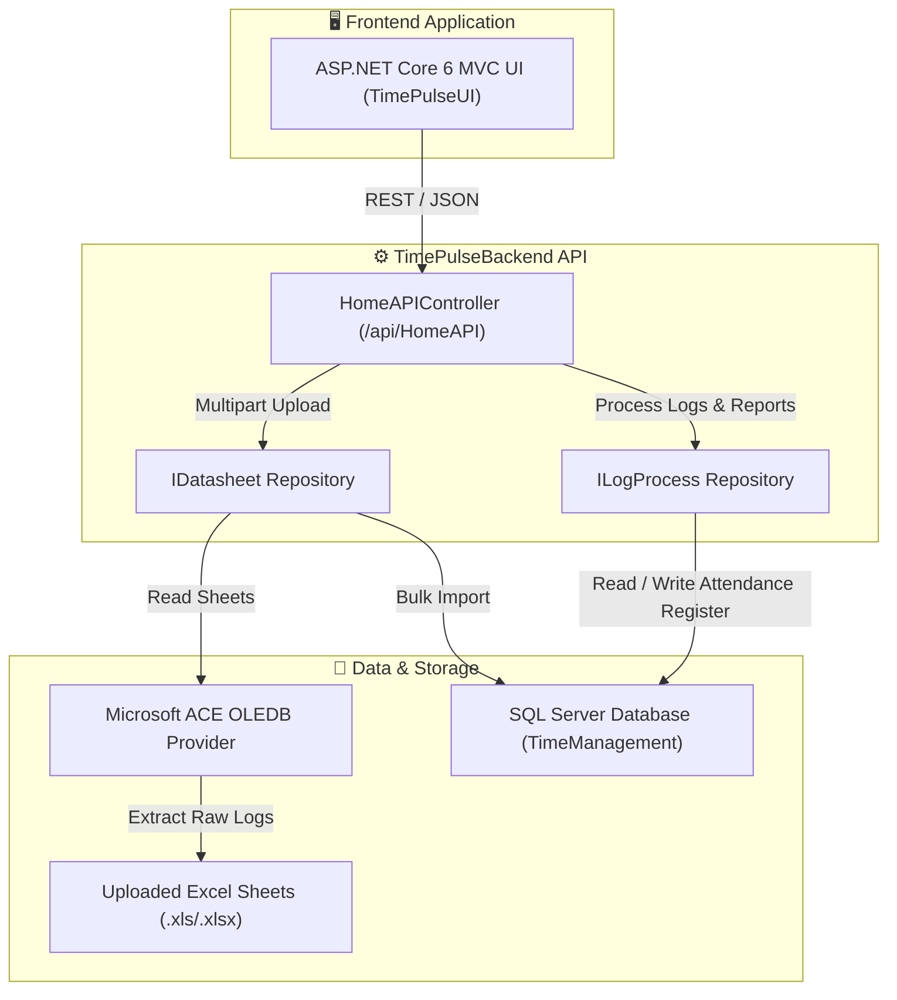

# ⏱️ TimePulseBackend

> **Enterprise-Grade Attendance & Workforce Management API Engine**

[](https://dotnet.microsoft.com/)
[](https://learn.microsoft.com/en-us/aspnet/core/)
[](https://learn.microsoft.com/en-us/ef/core/)
[](https://www.microsoft.com/en-us/sql-server/)
[](https://learn.microsoft.com/en-us/aspnet/core/mvc/overview)
[](https://swagger.io/)

---

## 📖 Overview

**TimePulseBackend** is a robust, high-performance **ASP.NET Core 6 Web API** built to handle automated employee attendance tracking, timesheet ingestion, intelligent time logging, and workforce analytics. 

Designed with modern clean architecture principles and Entity Framework Core, **TimePulseBackend** serves as the central data processing and reporting engine. It seamlessly connects with and powers its companion frontend user interface, which is developed using **ASP.NET Core 6 MVC**.

---

## ✨ Key Features

- 📊 **Automated Excel Timesheet Ingestion**: Directly upload and parse employee attendance logs from `.xls` / `.xlsx` spreadsheet sheets using high-speed Microsoft ACE OLEDB data adapters.
- ⚙️ **Intelligent Log Processing & Attendance Calculation**: Automatically aggregate raw check-in and check-out logs by month and year. Compute precise daily metrics:
  - Total working hours and net duration
  - Late-in duration (in minutes)
  - Early-out duration (in minutes)
  - Overtime calculation (in minutes)
  - Automated weekend (Week-Off) and holiday detection
- 📈 **Work Hour & Payroll Analytics**: Generate detailed work hour reports and summaries optimized for payroll integration and workforce monitoring.
- 🔌 **Seamless MVC UI Integration**: Engineered specifically to feed real-time attendance data and report models to the **ASP.NET Core 6 MVC** web application frontend.
- 🛠️ **Interactive API Documentation**: Embedded Swagger / OpenAPI 3.0 documentation for effortless endpoint exploration, debugging, and testing.

---

## 🏗️ System Architecture & Workflow

The system is structured around the **Repository Pattern** to decouple data access logic from business controllers, ensuring high maintainability and testability.



---

## 💻 Technology Stack

| Component | Technology / Library | Version | Purpose |
| :--- | :--- | :--- | :--- |
| **Runtime & Framework** | [.NET SDK](https://dotnet.microsoft.com/) / ASP.NET Core Web API | `6.0` | Core REST API backend framework |
| **Frontend UI** | ASP.NET Core MVC | `6.0` | Companion user interface consuming the backend API |
| **ORM & Data Access** | `Microsoft.EntityFrameworkCore.SqlServer` | `7.0.4` | Entity relational mapping and database operations |
| **Database Engine** | Microsoft SQL Server | `2019+ / Express` | Primary relational database storage |
| **Excel Ingestion** | `System.Data.OleDb` | `7.0.0` | Microsoft Access / Excel ACE OLEDB 12.0 connector |
| **API Documentation** | `Swashbuckle.AspNetCore` | `6.2.3` | Interactive Swagger UI generation |

---

## 📁 Codebase Structure

```text
TimeManagementAPI/
├── AttendenceManagement/
│   └── AttendenceManagement/
│       ├── Controllers/
│       │   └── HomeAPIController.cs            # Primary REST API endpoints for Excel upload and log processing
│       ├── Infrastructure/
│       │   ├── IRepository/
│       │   │   ├── IDatasheet.cs               # Interface for document uploading and Excel parsing
│       │   │   └── ILogProcess.cs              # Interface for attendance calculations and reporting
│       │   └── Repository/
│       │       ├── Datasheet.cs                # OleDb Excel reader and raw employee log importer
│       │       └── LogProcessRepo.cs           # Core calculation engine for working hours, late ins, and overtime
│       ├── Models/
│       │   ├── AttAttendanceLog.cs             # Entity: Raw employee check-in / check-out timestamps
│       │   ├── AttAttendanceRegister.cs        # Entity: Processed daily attendance summaries & status flags
│       │   └── AttendanceManagement001Context.cs # EF Core Database Context
│       ├── ViewModels/
│       │   ├── MonthYearModel.cs               # Request payload model for filtering logs by month/year
│       │   └── ReportViewModel.cs              # Response DTO for detailed working hour analytics
│       ├── uploaded_doc/                       # Temporary staging folder for incoming spreadsheet uploads
│       ├── TimeConvertion.cs                   # Utility extension methods for time format parsing
│       ├── Program.cs                          # Dependency injection, CORS, and middleware pipeline setup
│       └── appsettings.json                    # Configuration for SQL Server & Excel OLEDB providers
└── README.md                                   # Project documentation
```

---

## 🚀 Getting Started

### 1. Prerequisites
- [**.NET 6.0 SDK**](https://dotnet.microsoft.com/download/dotnet/6.0) or later installed on your development machine.
- **Microsoft SQL Server** (or SQL Server Express / LocalDB).
- **Microsoft Access Database Engine 2010/2016 Redistributable** (Required for the 64-bit/32-bit ACE OLEDB driver to parse `.xls`/`.xlsx` files).

### 2. Configuration (`appsettings.json`)
Configure your database connection string and OLEDB provider settings in `AttendenceManagement/AttendenceManagement/appsettings.json`:

```json
{
  "ConnectionStrings": {
    "SQLConnection": "Server=YOUR_SERVER_NAME; Database=TimeManagement; Trusted_Connection=true; TrustServerCertificate=True; MultipleActiveResultSets=true;",
    "excelconnection": "Provider=Microsoft.ACE.OLEDB.12.0;Data Source={0};Extended Properties='Excel 8.0;HDR=YES'"
  }
}
```

### 3. Database Migration & Setup
Ensure your SQL Server instance is running, then apply the Entity Framework Core migrations to create the required tables (`AttAttendanceLog` and `AttAttendanceRegister`):

```bash
cd AttendenceManagement/AttendenceManagement
dotnet ef database update
```
*(Alternatively, execute your SQL database schema script directly against your SQL Server instance).*

### 4. Running the Backend Server
Launch the application using the .NET CLI or open the solution in Visual Studio 2022:

```bash
# Navigate to the project directory
cd AttendenceManagement/AttendenceManagement

# Restore dependencies and build
dotnet build

# Run the backend API server
dotnet run
```

The API will start running (defaulting to `https://localhost:7145` or `http://localhost:5145`).
Navigate to **`https://localhost:<port>/swagger`** in your web browser to access the interactive Swagger UI.

---

## 📡 API Endpoints Reference

The backend exposes RESTful HTTP endpoints under the `/api/HomeAPI` base route:

| HTTP Method | Endpoint | Request Payload | Description |
| :---: | :--- | :--- | :--- |
| `POST` | `/api/HomeAPI/PostExcelFile` | `multipart/form-data` (`file`: Excel file) | Uploads an employee attendance spreadsheet, extracts rows via OLEDB, and populates the database. |
| `POST` | `/api/HomeAPI/LogProcess` | `application/json` (`MonthYearModel`) | Triggers the attendance processing engine for a target month & year, calculating late minutes, work hours, and leaves. |
| `GET` | `/api/HomeAPI/GetList` | *None* | Retrieves a consolidated list of processed employee attendance records and working hour metrics. |

### Example Request: Log Processing (`POST /api/HomeAPI/LogProcess`)
```json
{
  "month": "07",
  "year": "2026"
}
```

### Example Response (`200 OK`)
```json
[
  {
    "id": 101,
    "userId": "EMP-0042",
    "userName": "Devansh",
    "attDate": "2026-07-04T00:00:00",
    "lateInMinute": 15.0,
    "eartlyOutMinute": 0.0,
    "workhour": 8.5,
    "overTimeMinute": 30.0,
    "isLeave": false,
    "isHoliday": false,
    "isWeekOff": false
  }
]
```

---

## 🎨 Frontend UI Integration (ASP.NET Core 6 MVC)

The user interface, **TimePulseUI**, is built using **ASP.NET Core 6 MVC** to provide a rich, responsive administrative dashboard for HR managers and employees.

### Integration Workflow
1. **Timesheet Upload View**: The MVC UI provides a file drag-and-drop form that posts `.xlsx` files directly to `POST /api/HomeAPI/PostExcelFile`.
2. **Attendance Dashboard**: When an administrator selects a month and year on the UI, an AJAX or HttpClient call triggers `POST /api/HomeAPI/LogProcess` on **TimePulseBackend** to calculate the metrics.
3. **Report Grid & Export**: The MVC controller fetches data from `GET /api/HomeAPI/GetList` and renders interactive data tables with filtering, pagination, and export capabilities.

> **Note**: When running the ASP.NET Core 6 MVC frontend locally alongside **TimePulseBackend**, ensure Cross-Origin Resource Sharing (CORS) or local development ports are configured appropriately so the MVC client can seamlessly communicate with this API service.

---

## 🛠️ Troubleshooting & Best Practices

- **OLEDB Provider Error (`The 'Microsoft.ACE.OLEDB.12.0' provider is not registered on the local machine`)**: Ensure you have installed the Microsoft Access Database Engine redistributable matching the architecture (32-bit vs. 64-bit) of your installed .NET runtime.
- **File Upload Staging**: Verify that the application has write permissions to the `uploaded_doc/` folder where temporary Excel files are stored prior to ingestion.
- **SQL Server Connection**: If encountering login failures, verify `TrustServerCertificate=True` is included in your connection string when using SQL Server Express or local development certificates.

---

## 📄 License & Copyright

Copyright © 2026 **TimePulseUI**. All rights reserved.
Developed for enterprise employee attendance and workforce optimization.